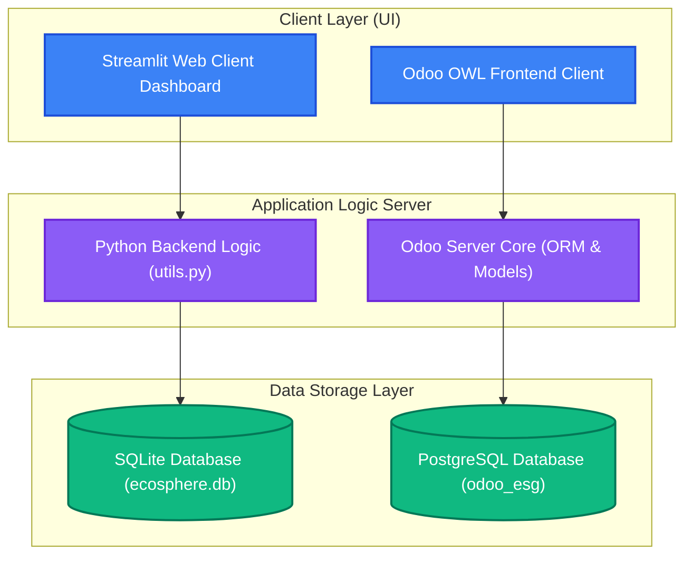
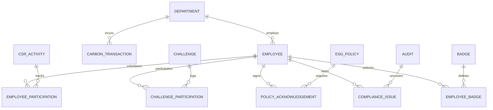
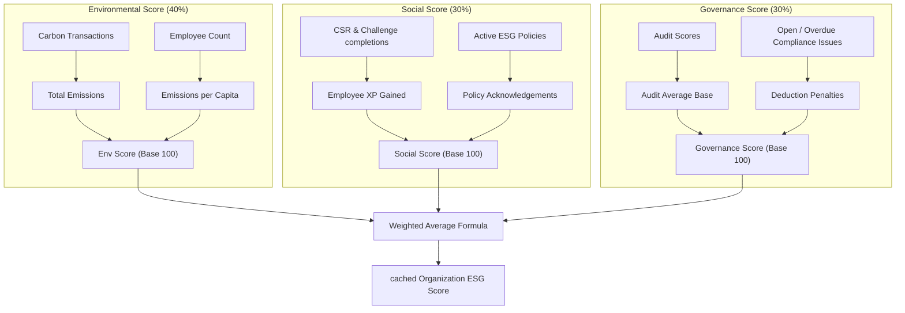

# 🌎 EcoSphere: ESG Management & Gamification Platform

**Project:** EcoSphere (Odoo Hackathon 2026 entry)  
**Team:** Omkar Gunde (Lead, Backend), Ridamn (Frontend, QA)  
**Evaluator:** [Evaluator's GitHub username]  

EcoSphere is a unified ESG (Environmental, Social, Governance) Management Platform that integrates carbon accounting, CSR activities, and compliance tracking into daily ERP operations, incentivizing employees through gamification (XP, badges, and rewards).

---

## 🏗️ 3-Tier System Architecture



* **Client Layer (UI)**: EcoSphere provides dual frontends. The local prototype runs on a customizable Streamlit interface (mobile-responsive dashboard), while the production design uses Odoo's standard XML-based UI rendered by the OWL web client.
* **Application Layer**: Contains Python controllers and model handlers. The backend applies score calculations, toggles business rules (auto-emissions, badge locks, alerts), and coordinates with the ORM.
* **Data Storage Layer**: In local/simulator mode, data is cached in SQLite (`ecosphere.db`). For the Odoo server installation, data is persistently managed in PostgreSQL.

---

## 📊 Database Model Entity Relationships (ERD)



* **Master Configuration Data**: Includes `DEPARTMENT`, `EMPLOYEE`, `ESG_POLICY`, `BADGE`, `REWARD`, `EMISSION_FACTOR`, and `CSR_ACTIVITY`. These models set up core organizational settings.
* **Transactional Tracking**: Tracks active events. For example, `CARBON_TRANSACTION` links emissions to departments; `POLICY_ACKNOWLEDGEMENT` maps which employees signed off on guidelines; `EMPLOYEE_PARTICIPATION` and `CHALLENGE_PARTICIPATION` log CSR volunteering and challenge completions; and `COMPLIANCE_ISSUE` details violations linked to specific audits.

---

## 📈 ESG Score Calculation Data Flow



* **Environmental Calculation**: Dynamic computation deducting points from a base of 100 based on carbon emissions relative to headcount.
* **Social Calculation**: Assesses CSR volunteering, challenges completed (XP gained), and policy acknowledgements signoff rates.
* **Governance Calculation**: Evaluates the average rating from internal audits, deducting penalties for unresolved or overdue compliance issues.
* **Overall Rating**: Applies organizational weightings (default: 40% Env, 30% Soc, 30% Gov) to generate a single corporate ESG Index.

---

## 💻 Tech Stack
* **ERP Framework**: Odoo v17/18/19 (Community/Enterprise)
* **Demo Frontend**: Streamlit (Python 3.10+)
* **Database**: PostgreSQL (Production) / SQLite (Simulated local environment)
* **Visualizations**: Altair, Pandas

---

## 🚀 Getting Started (Streamlit Simulator)

1. **Install Python dependencies**:
   ```bash
   pip install streamlit pandas altair
   ```
2. **Start development server**:
   ```bash
   streamlit run app.py
   ```
3. Open your browser and navigate to `http://localhost:8501`.

---

## 📦 Odoo Module Installation (`ecosphere_esg/`)
1. Copy the `ecosphere_esg/` directory to your Odoo custom addons directory.
2. Ensure Odoo is configured to load this directory in `addons-path`.
3. Log in to Odoo as an Administrator, activate Developer Mode, and click **Update Apps List**.
4. Search for `EcoSphere ESG Management` and click **Install**.
